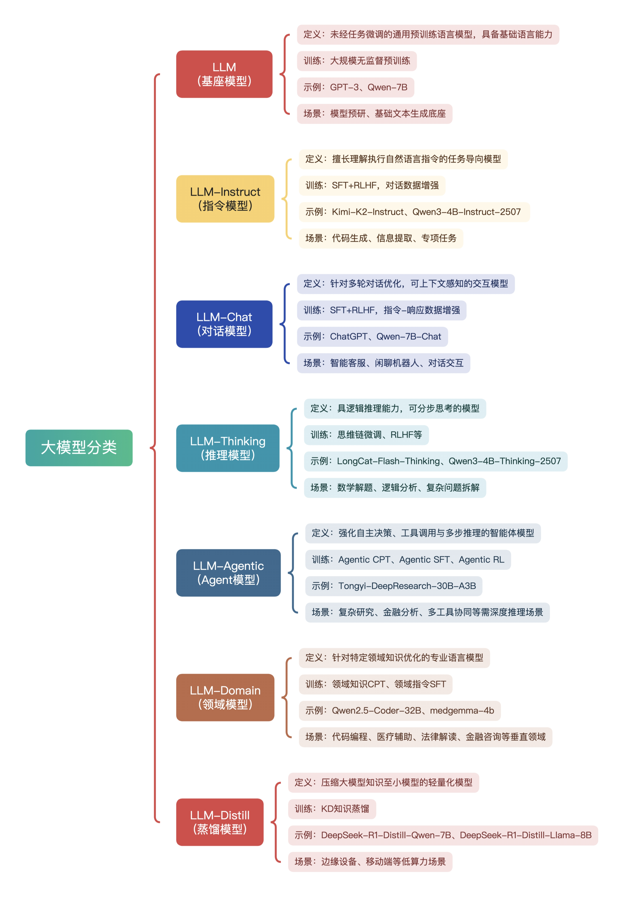
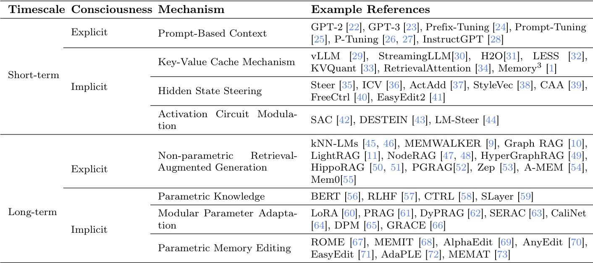

# tinker-ai-archive
📦 AI 折腾哥的技术资料存档库收录历史分享的开源 AI 项目拆解笔记、基础知识脑图、工具手册及技术整理，含源码注释、踩坑指南等硬核内容。持续更新，供 AI 学习者参考存档，折腾路上一起攒干货～
# tinker-ai-archive 📦

AI折腾哥的技术资料存档库，收录开源AI项目拆解、基础知识脑图、工具手册等硬核内容，助力AI学习者系统成长。

## 目录结构
     tinker-ai-archive/
     ├── assets/                     # 图片资源库
     │   ├── architecture/           # 架构图资源
     │   ├── llm_base/               # 思维导图资源
     │   └── qrcode/                 # 二维码资源
     │
     ├── open-source-analysis/      # 开源项目深度拆解
     │   ├── tongyi-webagent/       # 通义WebAgent项目
     │   │   ├── WebWalker Agent.xmind    # WebWalker框架思维导图
     │   │   ├── WebWalkerQA.md           # QA数据集格式解析
     │   │   ├── WebWalkerQA-20251003145409.md  # QA数据集详细分析
     │   │   └── WebWalkerGraph.md        # 图数据结构解析
     │   └── [project-name]/        # 其他项目名称（如stable-diffusion）
     │       ├── architecture.md    # 架构解析
     │       ├── deployment-guide/  # 部署指南与踩坑
     │       └── related-resources/ # 相关资源推荐
     │
     ├── basic-knowledge/           # 基础知识体系
     │   ├── llm/                   # LLM 领域
     │   │   ├── mindmap/           # 思维导图（XMind/PNG）
     │   │   │   ├── llm_category.jpg          # LLM 分类思维导图
     │   │   │   ├── llm_name_split.jpg        # LLM 名称参数思维导图
     │   │   │   ├── openai_chat_conversation_interface.xmind  # OpenAI 对话接口思维导图
     │   │   │   ├── openai_core_api.xmind     # OpenAI 核心 API 思维导图
     │   │   │   ├── openai_v1_chat_completions_api.xmind      # OpenAI v1 对话完成 API 思维导图
     │   │   │   └── openai_vector_embedding_interface.xmind    # OpenAI 向量嵌入接口思维导图
     │   │   ├── LLM_Classification.md         # LLM 分类文档
     │   │   └── LLM_Names_and_Parameters.md   # LLM 名称与参数文档
     │   └── memory/                # AI 记忆系统
     │       ├── mindmap/           # 记忆系统思维导图
     │       │   ├── 大模型记忆系统分类.xmind     # AI记忆系统分类思维导图
     │       │   ├── llm_mem_category.jpeg       # 记忆系统分类图
     │       │   └── llm_mem_history.jpeg        # 记忆系统发展历程图
     │       └── mem.md            # AI记忆系统分类详解

## 基础知识思维导图示例

### LLM基础分类思维导图
LLM基础分类思维导图：

### AI记忆系统分类
新增AI记忆系统分类内容，包含七种分类维度的详细解析：

## 开源技术架构拆解示例

### 通义WebAgent项目分析
新增通义WebAgent项目深度拆解，包含WebWalker框架解析、QA数据集格式详解等内容。该项目专注于LLM网页遍历能力评估，提供680个高质量问答对数据集。

### 典型AI项目架构解析
以下是典型AI项目的架构解析示例：

## 如何使用

1. 直接浏览对应目录获取所需资料
2. 使用仓库搜索功能查找特定内容

## 许可证

本仓库资料采用CC BY-NC-SA 4.0许可协议，转载请注明来源"AI折腾哥"

### 👋 欢迎交流
感谢关注！这里的资料会持续更新，如果你有想看的技术拆解、遇到的学习难题，欢迎通过以下方式联系我：

**微信交流**  

**小红书关注**  

一起在AI技术圈折腾成长，让干货落地～ 🚀